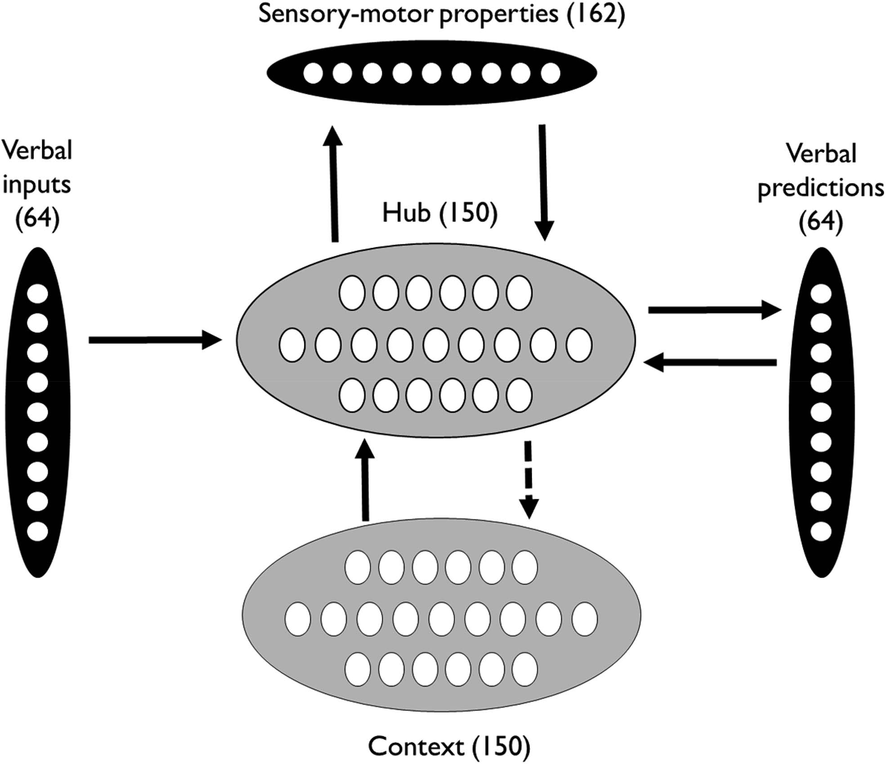
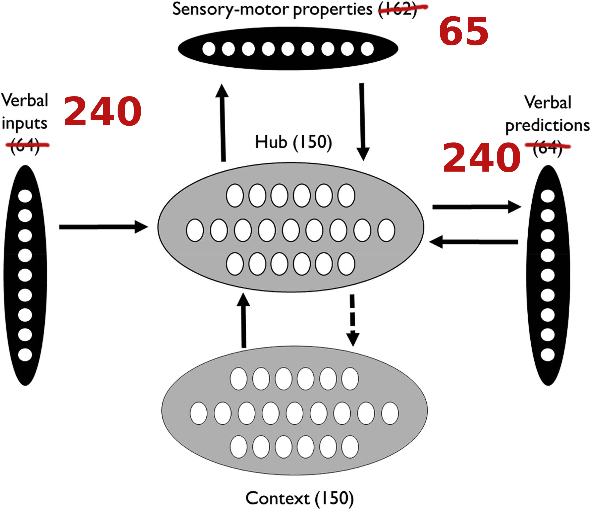

# BM
This is to create a TF model of combining the Binder and McClelland Data

# Plan

There is a Hoffman and McCleland paper where a model is put forward with the following structure:

My first project is to apply this to our model and build it in TensorFlow (keeping the design the same)

The model will be created using the Keras wrapper for TF